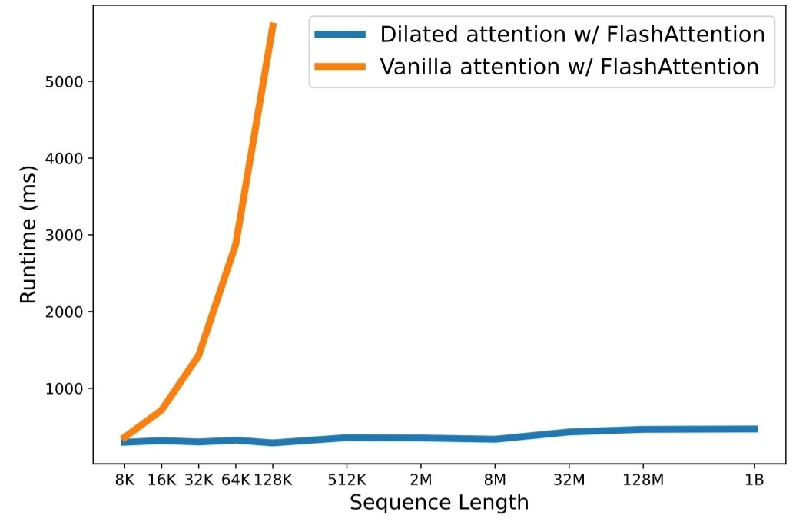

[](https://discord.gg/qUtxnK2NMf)


# LongNet: Scaling Transformers to 1,000,000,000 Tokens



[](https://github.com/kyegomez/LongNet/issues) 
[](https://github.com/kyegomez/LongNet/network) 
[](https://github.com/kyegomez/LongNet/stargazers) [](https://github.com/kyegomez/LongNet/blob/master/LICENSE)
[](https://twitter.com/intent/tweet?text=Excited%20to%20introduce%20LongNet,%20the%20all-new%20LongSequence%20model%20with%20the%20potential%20to%20revolutionize%20automation.%20Join%20us%20on%20this%20journey%20towards%20a%20smarter%20future.%20%23LongNet%20%23LongSequence&url=https%3A%2F%2Fgithub.com%2Fkyegomez%2FLongNet)
[](https://www.facebook.com/sharer/sharer.php?u=https%3A%2F%2Fgithub.com%2Fkyegomez%2FLongNet)
[](https://www.linkedin.com/shareArticle?mini=true&url=https%3A%2F%2Fgithub.com%2Fkyegomez%2FLongNet&title=Introducing%20LongNet%2C%20the%20All-New%20LongSequence%20Model&summary=LongNet%20is%20the%20next-generation%20LongSequence%20model%20that%20promises%20to%20transform%20industries%20with%20its%20intelligence%20and%20efficiency.%20Join%20us%20to%20be%20a%20part%20of%20this%20revolutionary%20journey%20%23LongNet%20%23LongSequence&source=)

[](https://www.reddit.com/submit?url=https%3A%2F%2Fgithub.com%2Fkyegomez%2FLongNet&title=Exciting%20Times%20Ahead%20with%20LongNet%2C%20the%20All-New%20LongSequence%20Model%20%23LongNet%20%23LongSequence) [](https://news.ycombinator.com/submitlink?u=https%3A%2F%2Fgithub.com%2Fkyegomez%2FLongNet&t=Exciting%20Times%20Ahead%20with%20LongNet%2C%20the%20All-New%20LongSequence%20Model%20%23LongNet%20%23LongSequence)
[](https://pinterest.com/pin/create/button/?url=https%3A%2F%2Fgithub.com%2Fkyegomez%2FLongNet&media=https%3A%2F%2Fexample.com%2Fimage.jpg&description=LongNet%2C%20the%20Revolutionary%20LongSequence%20Model%20that%20will%20Change%20the%20Way%20We%20Work%20%23LongNet%20%23LongSequence)
[](https://api.whatsapp.com/send?text=I%20just%20discovered%20LongNet,%20the%20all-new%20LongSequence%20model%20that%20promises%20to%20revolutionize%20automation.%20Join%20me%20on%20this%20exciting%20journey%20towards%20a%20smarter%20future.%20%23LongNet%20%23LongSequence%0A%0Ahttps%3A%2F%2Fgithub.com%2Fkyegomez%2FLongNet)


This is an open source implementation for the paper [LongNet: Scaling Transformers to 1,000,000,000 Tokens](https://arxiv.org/abs/2307.02486) by Jiayu Ding, Shuming Ma, Li Dong, Xingxing Zhang, Shaohan Huang, Wenhui Wang, Furu Wei. The LongNet is a Transformer variant designed to scale sequence length up to more than 1 billion tokens without sacrificing performance on shorter sequences.


### News 📰
* **This implementation of LongNet is brought to you by Agora, we're an all-new open source AI research organization with 1,500+ AI researchers all striving to advance Humanity!** **[Join us and help contribute to LongNet and or recieve FAST support in the Agora discord!](https://discord.gg/qUtxnK2NMf)**
* **[Execute tasks and help accelerate AI research with the project board](https://github.com/users/kyegomez/projects/3/views/2)**

## Installation

```shell
pip install LongNet
```

## Usage

Once you have installed LongNet, you can use the `DilatedAttention` class as follows:

```python
import timeit
import torch
from longnet.attention import DilatedAttention


#model config
d_model = 512
num_heads = 8
dilation_rate = 2
segment_size = 64

device = "cuda:0"
dtype=torch.float16

#input data
batch_size = 32
seq_len = 10000000


#create model and data
model = DilatedAttention(d_model, num_heads, dilation_rate, segment_size).to(device)
x = torch.randn((batch_size, seq_len, d_model), device=device, dtype=dtype)


#test forward pass
with torch.no_grad():
    output = model(x)
    print(f"Output shape: {output.shape}") # expected (batch_size, seq_Len)


#benchmark model
num_runs = 1000
start_time = timeit.default_timer()
for _ in range(num_runs):
    model(x)

elapsed_time = timeit.default_timer() - start_time
print(f"Average forward pass time: {elapsed_time / num_runs:.6f} seconds")

```

## Introduction

Scaling sequence length has become a critical bottleneck in the era of large language models. However, existing methods struggle with either computational complexity or model expressivity, rendering the maximum sequence length restricted. In this paper, they introduce LongNet, a Transformer variant that can scale sequence length to more than 1 billion tokens, without sacrificing the performance on shorter sequences. Specifically, they propose dilated attention, which expands the attentive field exponentially as the distance grows.

## Features
LongNet has significant advantages:
1. It has a linear computation complexity and a logarithm dependency between tokens.
2. It can be served as a distributed trainer for extremely long sequences.
3. Its dilated attention is a drop-in replacement for standard attention, which can be seamlessly integrated with the existing Transformer-based optimization.

Experiment results demonstrate that LongNet yields strong performance on both long-sequence modeling and general language tasks. Their work opens up new possibilities for modeling very long sequences, e.g., treating a whole corpus or even the entire Internet as a sequence.

Here's the updated usage and installation section with two methods: git clone or pip install LongNet:

# Documentation

* [Click here for the model documentation](docs/DOCUMENTATION.md)

# Training the Model
* We're still working on the model configuation as closely in the paper as possible. There are 2 methods, one is `accelerate` and the other `from LongNet import Train`

### Method 1 

* Git clone installation

* Init your parameters `accelerate config`

* Then `accelerate launch LongNet/training.py`

# Method 2

* Pip install method

```python

from LongNet import Train

Train()

```
---


## Share with Friends
Share LongNet with your friends and colleagues who might find it useful. Simply click on the links below to share on various platforms:

- [Facebook](https://www.facebook.com/sharer/sharer.php?u=https%3A%2F%2Fgithub.com%2Fkyegomez%2FLongNet)
- [Twitter](https://twitter.com/intent/tweet?url=https%3A%2F%2Fgithub.com%2Fkyegomez%2FLongNet&text=Check%20out%20the%20LongNet%20repository%2C%20an%20implementation%20for%20scaling%20Transformers%20to%201%2C000%2C000%2C000%20tokens.%20%23LongNet%20%23Transformers)
- [LinkedIn](https://www.linkedin.com/shareArticle?url=https%3A%2F%2Fgithub.com%2Fkyegomez%2FLongNet&title=LongNet%3A%20Scaling%20Transformers%20to%201%2C000%2C000%2C000%20Tokens)
- [Reddit](https://reddit.com/submit?url=https%3A%2F%2Fgithub.com%2Fkyegomez%2FLongNet&title=LongNet%3A%20Scaling%20Transformers%20to%201%2C000%2C000%2C000%20Tokens)
- [WhatsApp](https://wa.me/?text=Check%20out%20the%20LongNet%20repository%2C%20an%20implementation%20for%20scaling%20Transformers%20to%201%2C000%2C000%2C000%20tokens%3A%20https%3A%2F%2Fgithub.com%2Fkyegomez%2FLongNet)
- [Email](mailto:?subject=Check%20out%20the%20LongNet%20repository&body=Hey%2C%0A%0ACheck%20out%20the%20LongNet%20repository%2C%20an%20implementation%20for%20scaling%20Transformers%20to%201%2C000%2C000%2C000%20tokens%3A%0A%0Ahttps%3A%2F%2Fgithub.com%2Fkyegomez%2FLongNet%0A%0AEnjoy%21)
- [Hacker News](https://news.ycombinator.com/submitlink?u=https%3A%2F%2Fgithub.com%2Fkyegomez%2FLongNet&t=LongNet%3A%20Scaling%20Transformers%20to%201%2C000%2C000%2C000%20Tokens)

Thank you for sharing!

[Share LongNet Repository](https://github.com/kyegomez/LongNet)


# Roadmap

* Recreate the sparsification mechanism

* Recreate the gathering mechanism

* Implement FlashAttention2.0

* Implement Distributed Setup

*  create the all-gather operation in the backward that becomes a reduce-scatter operation


## Citation
```
@inproceedings{ding2023longnet,
  title={LongNet: Scaling Transformers to 1,000,000,000 Tokens},
  author={Ding, Jiayu and Ma, Shuming and Dong, Li and Zhang, Xingxing and Huang, Shaohan and Wang, Wenhui and Wei, Furu},
  booktitle={Proceedings of the 10th International Conference on Learning Representations},
  year={2023}
}
```

